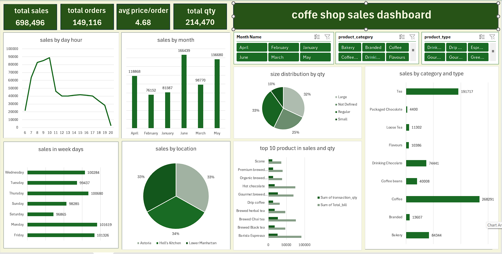

# Coffee-Shop-Excel-Dashboard
# ☕ Coffee Shop Sales Dashboard

An interactive Excel dashboard analyzing a coffee shop's **sales performance**.  
The goal of this project is to provide insights into **sales trends, revenue, top products, customer behavior, and branch performance**.

---

## 🎯 Project Objectives
- Analyze **total sales** and **number of orders**  
- Calculate **average order value per customer**  
- Track **quantity sold** per product  
- Identify **top-selling products** by quantity and revenue  
- Monitor sales by **hour of day** and **day of week** to find peak times  
- Compare sales across **months** and **store locations**  
- Analyze sales by **product category** and **type**  

---

## 🗂 Dataset
The dataset was clean and ready for analysis. No major data cleaning was required.  
Files:
- `coffee_data.xlsx` → Cleaned dataset used for the dashboard  
- `coffee_dashboard.xlsx` → Final interactive dashboard with PivotTables, Charts, and Slicers  

---

## 📊 Dashboard KPIs & Metrics
- **Total Sales**  
- **Number of Orders**  
- **Average Order Value per Customer**  
- **Quantity Sold**  
- **Top Products by Revenue and Quantity**  

---

## 🔍 Analyses & Charts
- **Sales by Hour of Day** → Identify peak hours  
- **Sales by Day of Week** → Identify peak days  
- **Total Sales by Month** → Track monthly trends  
- **Sales by Product Type / Category** → Compare different products and beverages  
- **Top 10 Products** → By quantity and revenue  
- **Sales by Branch / Location** → Compare performance across stores  

---

## 🎛 Interactivity
The dashboard contains **Slicers** for dynamic filtering:
1. Product Category  
2. Branch / Location  
3. Hour / Day / Month  

> This allows users to explore data interactively and quickly identify trends.

---

## 🧠 Skills Demonstrated
- Excel **PivotTables** & **PivotCharts**  
- **Slicers & Filters** for interactivity  
- Creating **KPIs** and performance metrics  
- Data visualization using **Bar, Line, Pie Charts**  
- Analyzing trends by **time, product, and location**

---

## 🖼️ Dashboard Preview

---

## 💡 Notes
This dashboard was designed based on the client's requests and focuses on **sales analysis**.  
Additional analyses beyond the client's requirements were not included to keep the dashboard clean and focused.
